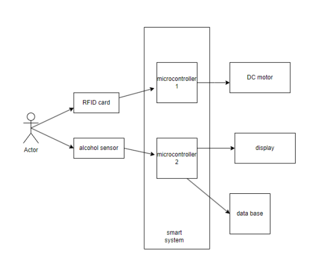
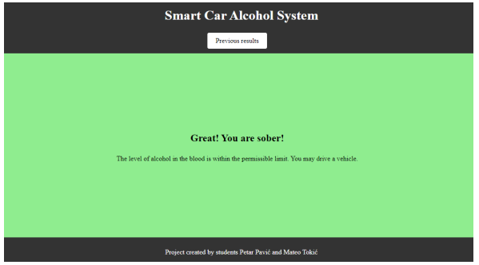
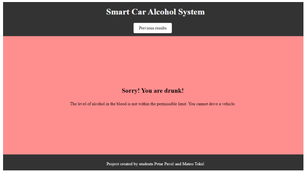
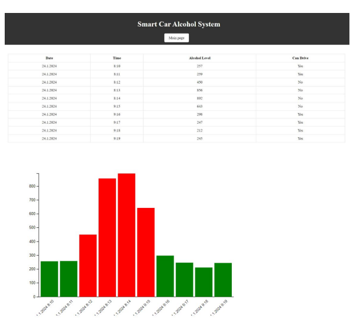
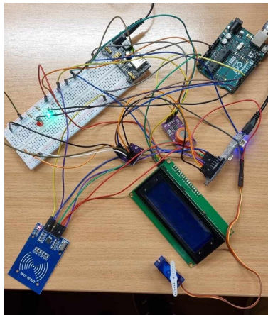
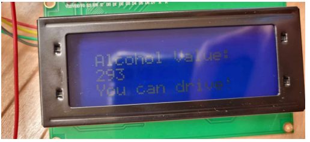

# **Safe Vehicle Start with Integrated Alcohol Sensor**

This project combines **RFID technology** and the **MQ3 alcohol sensor** to ensure safe vehicle operation. The system allows vehicle unlocking using an **RFID card**, followed by a check of the driver's alcohol level. If the alcohol level is below the permitted threshold, the driver is allowed to start the vehicle.

---

## **Project Overview**
- **Arduino script** for sensor readings and component control.
- **ESP8266 code** for WiFi connectivity and MQTT communication.
- **Python Tornado server** for storing data in a database and communicating via WebSocket.
- **Web application** for real-time display of sensor readings.

---

## **Components Used**
| Component                      | Description                                 |
|--------------------------------|--------------------------------------------|
| **Arduino Uno**                | Main microcontroller for the system.       |
| **MFRC-522 RFID Reader**       | Reads the RFID card for authentication.    |
| **MQ3 Alcohol Sensor**         | Detects alcohol level in the driver's breath. |
| **LCD 20x4 I2C Display**       | Displays alcohol reading results.          |
| **Servo Motor**                | Controls vehicle locking/unlocking.        |
| **ESP8266 WiFi Module**        | Sends data via MQTT protocol.              |
| **Tornado Server**             | Python server for WebSocket and database.  |

---

## **Technologies Used**
- **Arduino IDE**: For programming Arduino and ESP8266.
- **MQTT**: Communication between microcontrollers and the server.
- **Python Tornado**: Server for WebSocket communication and SQLite database.
- **D3.js**: Data visualization on the web page.
- **HTML/CSS/JS**: Frontend for the web application.

---

## **How It Works**
1. The user unlocks the system using an **RFID card**.
2. The system reads the **alcohol level** using the **MQ3 sensor**.
3. The result is displayed on the **LCD screen**:
   - "You can drive!" - Alcohol level is below the threshold.
   - "Cannot drive!" - Alcohol level exceeds the threshold.
4. Data is stored in the **SQLite database** and sent to the **web application**.

---

## **Project Images**

---

## **Contributors**
- **Petar Pavić**
- **Mateo Tokić**

---

